# AdaptUI showcase

<table width="100%" id="showcase_table">
    <tr>
        <th style="width: 40%">Name</th>
        <th>Screenshot</th>
    </tr>
    <tr>
        <td>
            

                <h3>[Showcase] AdaptUI basic</h3>
                Shows basic concepts and usage &mdash; <em>VStack</em>, <em>HStack</em>, <em>ZStack</em>
                 
                <a href="./sample/src/main/java/io/noties/adapt/sample/samples/showcase/AdaptUIShowcaseBasic1.kt">AdaptUIShowcaseBasic1</a>
            

        </td>
        <td><a href="./art/ui_showcase_basic1.jpg">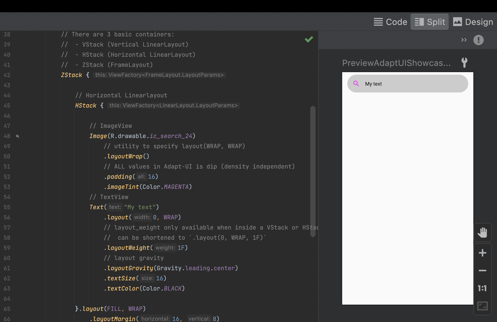</a></td>
        </tr><tr>
        <td>
            

                <h3>[Showcase] AdaptUI basic2</h3>
                Shows basic concepts and usage &mdash; <em>VScroll</em>, <em>HScroll</em>
                 
                <a href="./sample/src/main/java/io/noties/adapt/sample/samples/showcase/AdaptUIShowcaseBasic2.kt">AdaptUIShowcaseBasic2</a>
            

        </td>
        <td><a href="./art/ui_showcase_basic2.jpg">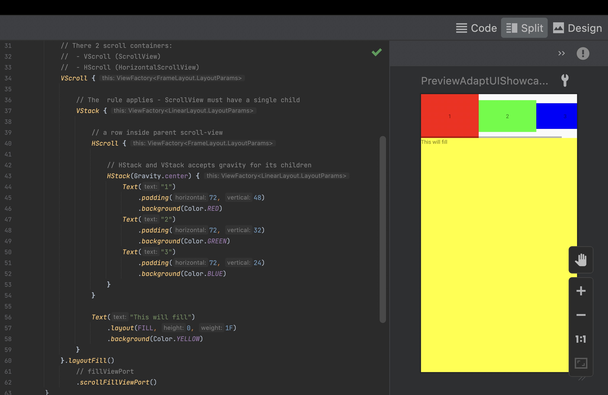</a></td>
        </tr><tr>
        <td>
            

                <h3>[Showcase] AdaptUI control flow</h3>
                <em>For loop</em>, <em>forEach</em>, <em>if-else</em>, <em>while</em>
                 
                <a href="./sample/src/main/java/io/noties/adapt/sample/samples/showcase/AdaptUIShowcaseControlFlow.kt">AdaptUIShowcaseControlFlow</a>
            

        </td>
        <td></td>
        </tr><tr>
        <td>
            

                <h3>[Showcase] AdaptUI reference elements</h3>
                Access to created elements as regular objects
                 
                <a href="./sample/src/main/java/io/noties/adapt/sample/samples/showcase/AdaptUIShowcaseReference.kt">AdaptUIShowcaseReference</a>
            

        </td>
        <td><a href="./art/ui_showcase_reference1.jpg">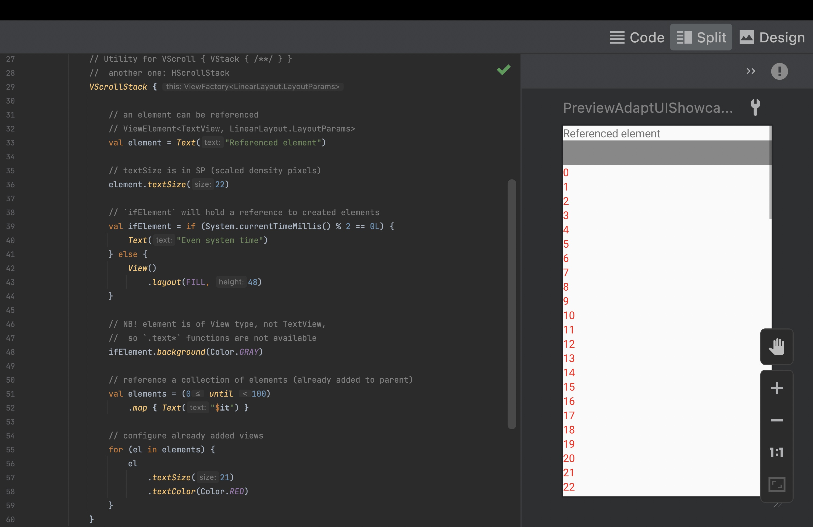</a></td>
        </tr><tr>
        <td>
            

                <h3>[Showcase] AdaptUI <em>Text</em> element</h3>
                <em>TextView</em> and siblings &mdash; <em>EditText</em>, <em>Button</em>, etc
                 
                <a href="./sample/src/main/java/io/noties/adapt/sample/samples/showcase/AdaptUIShowcaseText1.kt">AdaptUIShowcaseText1</a>
            

        </td>
        <td></td>
        </tr><tr>
        <td>
            

                <h3>[Showcase] AdaptUI <em>Text</em> element #2</h3>
                <em>TextView</em> and siblings &mdash; <em>EditText</em>, <em>Button</em>, etc
                 
                <a href="./sample/src/main/java/io/noties/adapt/sample/samples/showcase/AdaptUIShowcaseText2.kt">AdaptUIShowcaseText2</a>
            

        </td>
        <td></td>
        </tr><tr>
        <td>
            

                <h3>[Showcase] AdaptUI, element style</h3>
                Combine common styles to be reused
                 
                <a href="./sample/src/main/java/io/noties/adapt/sample/samples/showcase/AdaptUIShowcaseStyle.kt">AdaptUIShowcaseStyle</a>
            

        </td>
        <td></td>
        </tr><tr>
        <td>
            

                <h3>[Showcase] AdaptUI, Shape #1</h3>
                <em>RectangleShape</em>, <em>CircleShape</em>, <em>TextShape</em>, <em>CornersShape</em>, <em>RoundedRectangleShape</em>
                 
                <a href="./sample/src/main/java/io/noties/adapt/sample/samples/showcase/AdaptUIShowcaseShape1.kt">AdaptUIShowcaseShape1</a>
            

        </td>
        <td></td>
        </tr><tr>
        <td>
            

                <h3>[Showcase] AdaptUI, Shape #2</h3>
                <em>RectangleShape</em>, <em>ArcShape</em>, <em>OvalShape</em>, <em>Capsule</em>, <em>Line</em>
                 
                <a href="./sample/src/main/java/io/noties/adapt/sample/samples/showcase/AdaptUIShowcaseShape2.kt">AdaptUIShowcaseShape2</a>
            

        </td>
        <td></td>
        </tr><tr>
        <td>
            

                <h3>[Showcase] ShapeDrawable usage</h3>
                stateful hotspot
                 
                <a href="./sample/src/main/java/io/noties/adapt/sample/samples/showcase/AdaptUIShowcaseShapeDrawable.kt">AdaptUIShowcaseShapeDrawable</a>
            

        </td>
        <td><a href="./art/ui_showcase_shapedrawable.jpg">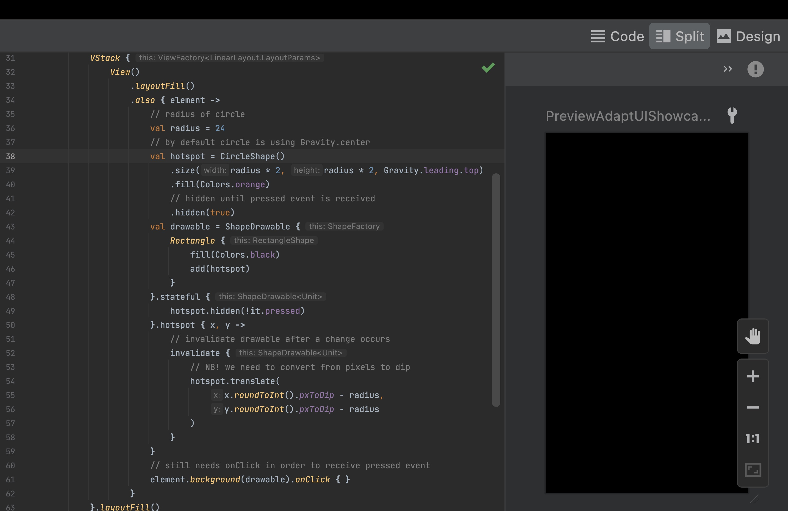</a></td>
        </tr><tr>
        <td>
            

                <h3>[Showcase] AdaptUI, Shape #3</h3>
                <em>AssetShape</em>
                 
                <a href="./sample/src/main/java/io/noties/adapt/sample/samples/showcase/AdaptUIShowcaseShape3.kt">AdaptUIShowcaseShape3</a>
            

        </td>
        <td></td>
        </tr><tr>
        <td>
            

                <h3>[Showcase] Circle Avatar</h3>
                
                 
                <a href="./sample/src/main/java/io/noties/adapt/sample/samples/showcase/AdaptUIShowcaseCircleAvatar.kt">AdaptUIShowcaseCircleAvatar</a>
            

        </td>
        <td><a href="./art/ui_showcase_circleavatar.jpg">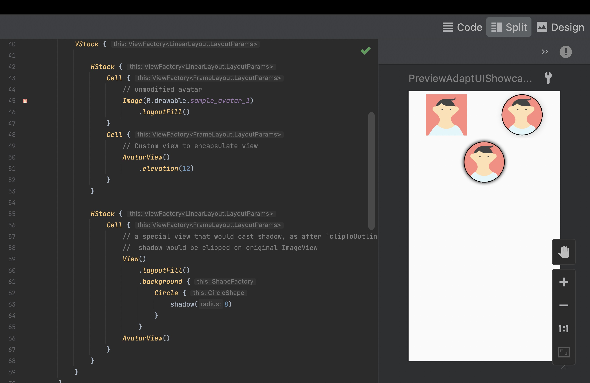</a></td>
        </tr><tr>
        <td>
            

                <h3>[Showcase] AdaptUI shape composition</h3>
                
                 
                <a href="./sample/src/main/java/io/noties/adapt/sample/samples/showcase/AdaptUIShowcaseShapeComposition.kt">AdaptUIShowcaseShapeComposition</a>
            

        </td>
        <td></td>
        </tr><tr>
        <td>
            

                <h3>[Showcase] AdaptUI, Shape #4</h3>
                <em>LabelShape</em>
                 
                <a href="./sample/src/main/java/io/noties/adapt/sample/samples/showcase/AdaptUIShowcaseShape4.kt">AdaptUIShowcaseShape4</a>
            

        </td>
        <td><a href="./art/ui_showcase_shape4.jpg">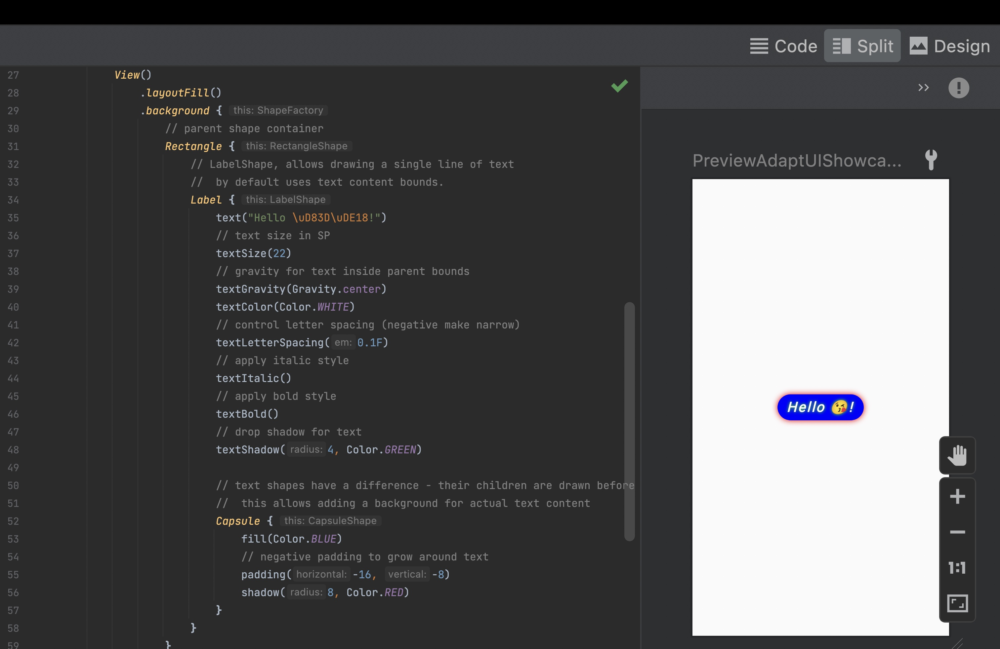</a></td>
        </tr><tr>
        <td>
            

                <h3>[Showcase] AdaptUI, Shape #5</h3>
                <em>TextShape</em>, only Android.O+
                 
                <a href="./sample/src/main/java/io/noties/adapt/sample/samples/showcase/AdaptUIShowcaseShape5.kt">AdaptUIShowcaseShape5</a>
            

        </td>
        <td></td>
        </tr><tr>
        <td>
            

                <h3>[Showcase] AdaptUI, Pager element</h3>
                <em>Pager</em>, <em>ViewPager</em>
                 
                <a href="./sample/src/main/java/io/noties/adapt/sample/samples/showcase/AdaptUIShowcasePager.kt">AdaptUIShowcasePager</a>
            

        </td>
        <td><a href="./art/ui_showcase_pager.jpg">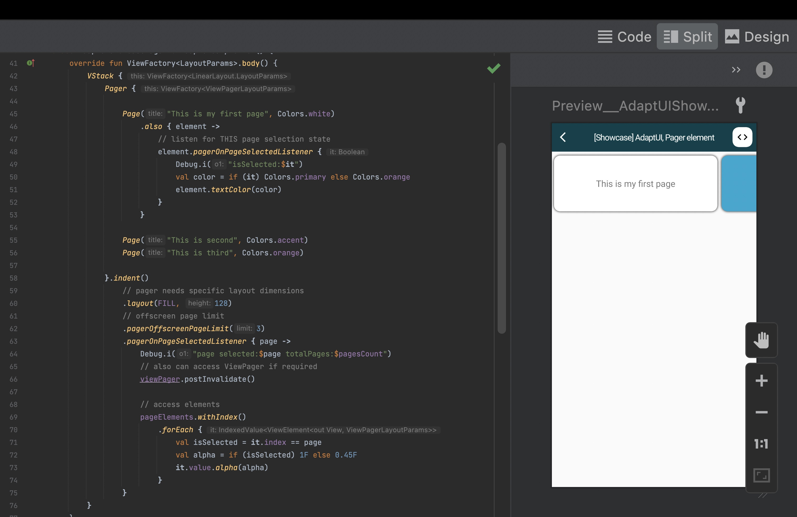</a></td>
        </tr><tr>
        <td>
            

                <h3>[Showcase] AdaptUI, Image</h3>
                <em>Image</em>, <em>ImageView</em>
                 
                <a href="./sample/src/main/java/io/noties/adapt/sample/samples/showcase/AdaptUIShowcaseImage.kt">AdaptUIShowcaseImage</a>
            

        </td>
        <td><a href="./art/ui_showcase_image.jpg">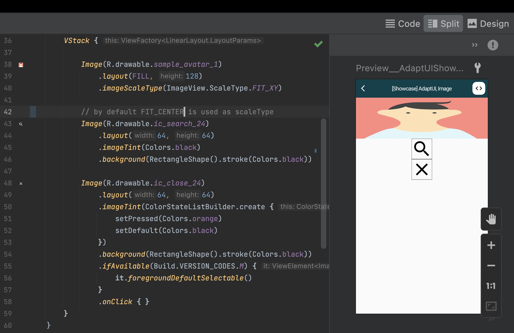</a></td>
        </tr><tr>
        <td>
            

                <h3>[Showcase] AdaptUI, Item</h3>
                Different usage of <em>Item</em> (including its siblings) in different contexts: directly in UI layout, in a <em>ViewGroup</em>, <em>RecyclerView</em> or <em>ListView</em> (via <em>AlertDialog</em>)
                 
                <a href="./sample/src/main/java/io/noties/adapt/sample/samples/showcase/AdaptUIShowcaseItem.kt">AdaptUIShowcaseItem</a>
            

        </td>
        <td><a href="./art/ui_showcase_item.jpg">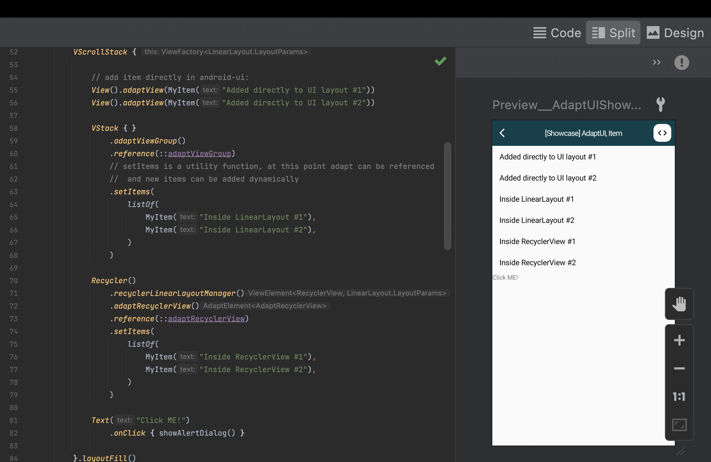</a></td>
        </tr><tr>
        <td>
            

                <h3>[Showcase] AdaptUI, Reference views and elements</h3>
                Assign views and elements with `.reference` utility extension
                 
                <a href="./sample/src/main/java/io/noties/adapt/sample/samples/showcase/AdaptUIShowcaseReference2.kt">AdaptUIShowcaseReference2</a>
            

        </td>
        <td><a href="./art/ui_showcase_reference2.jpg">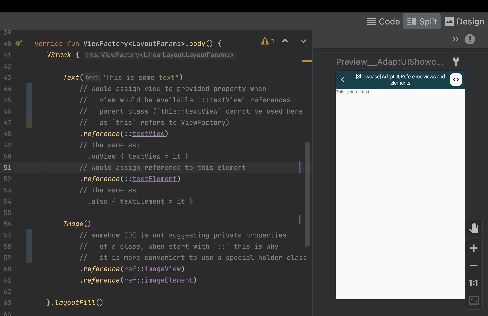</a></td>
        </tr><tr>
        <td>
            

                <h3>[Showcase] Layout preview</h3>
                Control how elements are rendering in layout preview window
                 
                <a href="./sample/src/main/java/io/noties/adapt/sample/samples/showcase/AdaptUIShowcasePreview.kt">AdaptUIShowcasePreview</a>
            

        </td>
        <td><a href="./art/ui_showcase_preview.jpg">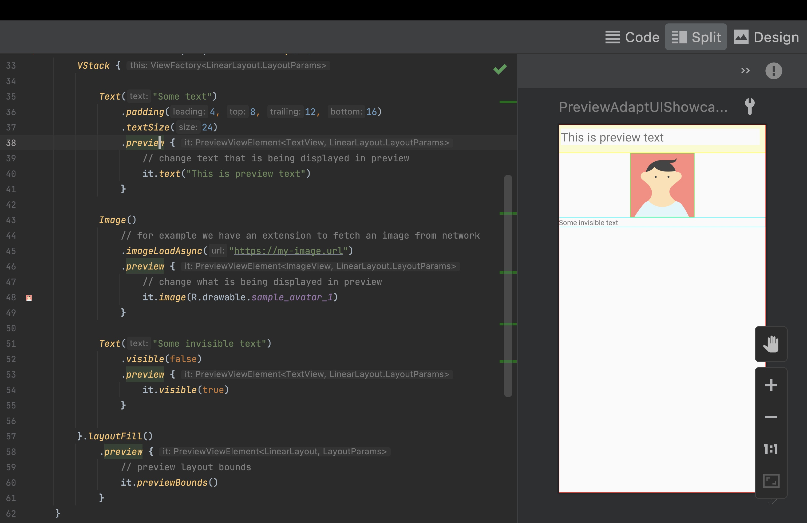</a></td>
        </tr><tr>
        <td>
            

                <h3>[Showcase] AdaptUI Web element</h3>
                Usage of a <em>WebView</em>
                 
                <a href="./sample/src/main/java/io/noties/adapt/sample/samples/showcase/AdaptUIShowcaseWeb.kt">AdaptUIShowcaseWeb</a>
            

        </td>
        <td></td>
        </tr>

</table>