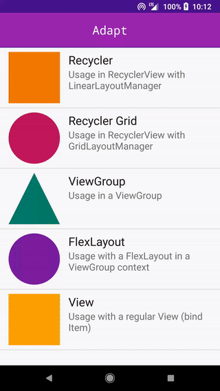

# Adapt

`RecyclerView.Adapter` only shorter. Abstraction to create re-usable components that can be used inside RecyclerView, ViewGroup or be bound to a View directly.



## Install

[](http://search.maven.org/#search|ga|1|g%3A%22ru.noties%22%20AND%20a%3A%22adapt%22)

```gradle
implementation "ru.noties:adapt:${adaptVersion}"
```

## Usage

Create an instance of an `Item`:

```kotlin
class ColorItem(
        @ColorInt private val color: Int
) : Item<ColorItem.Holder>(color.toLong()) {

    override fun createHolder(inflater: LayoutInflater, parent: ViewGroup): Holder {
        return Holder(inflater.inflate(R.layout.item_color, parent, false))
    }

    override fun render(holder: Holder) {
        holder.image.setBackgroundColor(color)
    }

    class Holder(itemView: View) : Item.Holder(itemView) {
        // `requireView` is a helper method to obtain view
        val image = requireView<View>(R.id.image)
    }
}
```

* Item must have a Holder associated
* Item must have a unique ID (which is set by super constructor)
* Item must implement 2 methods: `createHolder` and `render`

That's it. This item is now available to be used in a RecyclerView, any other ViewGroup or be bound directly to a View.

## Usage in RecyclerView

Create an instance of `Adapt`:
```kotlin
val adapt = Adapt.create();
```

Additionally you can specify which `DataSetChangeHandler` should be used. `Adapt` comes with 3 pre-defined implementations:
* `NotifyDataSetChanged` (_used by default_)
* `DiffUtilDataSetChanged`
* `AsyncDiffUtilDataSetChanged`

```kotlin
Adapt.create(NotifyDataSetChanged.create())
Adapt.create(DiffUtilDataSetChanged.create(/*detectMoves = */true))
Adapt.create(AsyncDiffUtilDataSetChanged.create(/*DiffUtilDataSetChanged.create()*/))
```

> Before `2.0.0` version, Adapt instance was _typed_ (`Adapt<T>`) which required explicit registration of items. Starting `2.0.0` it's no longer the case as each Item can render it-self

Initialize `RecyclerView`:

```kotlin
val adapt = Adapt.create()

val recycler = findViewById<RecyclerView>(R.id.recycler_view)
recycler.layoutManager = LinearLayoutManager(this)
recycler.adapter = adapt
```

Create a list of items and set them to an `Adapt` instance:

```kotlin
val items = listOf(
        ColorItem(Color.RED),
        ColorItem(Color.GREEN),
        ColorItem(Color.BLUE)
)
adapt.setItems(items)
```

To additionally process rendered items, for example adding a click listener, you can explicitly add `OnClickListener` to your item and apply it in `render` function. Or use `ItemWrapper`:

```kotlin
val items = listOf(
        OnClickWrapper(ColorItem(Color.RED)) { item, holder ->  
            Debug.i("I am read")
        },
        ColorItem(Color.GREEN),
        ColorItem(Color.BLUE)
)
```

> `OnClickWrapper` is a subclass of `ItemWrapper` that is bundled with the library.

Additionally, each Item can specify `RecyclerView.ItemDecoration` in a decoupled manner:

```kotlin
class ColorItem(
        @ColorInt private val color: Int
) : Item<ColorItem.Holder>(color.toLong()) {

    override fun createHolder(inflater: LayoutInflater, parent: ViewGroup): Holder {
        return Holder(inflater.inflate(R.layout.item_color, parent, false))
    }

    override fun render(holder: Holder) {
        holder.image.setBackgroundColor(color)
    }

    override fun recyclerDecoration(recyclerView: RecyclerView): RecyclerView.ItemDecoration? {
        return object: RecyclerView.ItemDecoration() {
            override fun getItemOffsets(outRect: Rect, view: View, parent: RecyclerView, state: RecyclerView.State) {
                outRect.set(16, 16, 16, 16)
            }
        }
    }

    class Holder(itemView: View) : Item.Holder(itemView) {
        val image = requireView<View>(R.id.image)
    }
}
```

Please note that returned `ItemDecoration` must be a _generic_ one, as only one decoration will be registered with RecyclerView for one item-view-type (read: _all instances of an item must return a decoration that does the same_). Which item's decoration will be used should be considered _undefined behaviour_ and **must not** be relied upon.

Also note that using an `ItemWrapper` only for some items to specify `ItemDecoration` might (and will) lead to unexpected results. Consider moving decoration to item itself or fallback to _old_ decoration registration (via `RecyclerView#addItemDecoration`)


## Usage in ViewGroup

Usage in a ViewGroup is almost the same and does not require any changes to an Item. But instead of `Adapt` - `AdaptViewGroup` should be used:

```kotlin
val adaptViewGroup = AdaptViewGroup.create(findViewById(R.id.flex_layout))
```

Create a list of items and apply them to `AdaptViewGroup`:

```kotlin
val items = listOf(
        OnClickWrapper(ColorItem(Color.RED)) { item, holder ->
            Debug.i("I am read")
        },
        ColorItem(Color.GREEN),
        ColorItem(Color.BLUE)
)
        
adaptViewGroup.setItems(items)
```

You can set items multiple times. `AdaptViewGroup` will _diff_ 2 sets of items to reduce layout operations. This works great with Android `TransitionManager`:

```kotlin
// use auto transition or define your own
TransitionManager.beginDelayedTransition(adaptViewGroup.viewGroup())
        
adaptViewGroup.setItems(items)
```

## Usage in View

Each Item can also be _bound_ to a standalone View. To create an instance of `AdaptView`:

```kotlin
// initialize by adding to a parent container
val adaptView = 
        AdaptView.append(findViewById(R.id.view_group), ColorItem(Color.RED))

// or specify which View to use (for example defined in layout XML)
val adaptView =
        AdaptView.create(findViewById(R.id.color_item_view), ColorItem(Color.RED)) {
            ColorItem.Holder(it)
        }
```

Then an Item can be applied to a `AdaptView` instance:

```kotlin
adaptView.setItem(ColorItem(Color.GREEN))
adaptView.setItem(ColorItem(Color.BLUE))
```

## License

```
  Copyright 2018 Dimitry Ivanov (mail@dimitryivanov.ru)

  Licensed under the Apache License, Version 2.0 (the "License");
  you may not use this file except in compliance with the License.
  You may obtain a copy of the License at

      http://www.apache.org/licenses/LICENSE-2.0

  Unless required by applicable law or agreed to in writing, software
  distributed under the License is distributed on an "AS IS" BASIS,
  WITHOUT WARRANTIES OR CONDITIONS OF ANY KIND, either express or implied.
  See the License for the specific language governing permissions and
  limitations under the License.
```