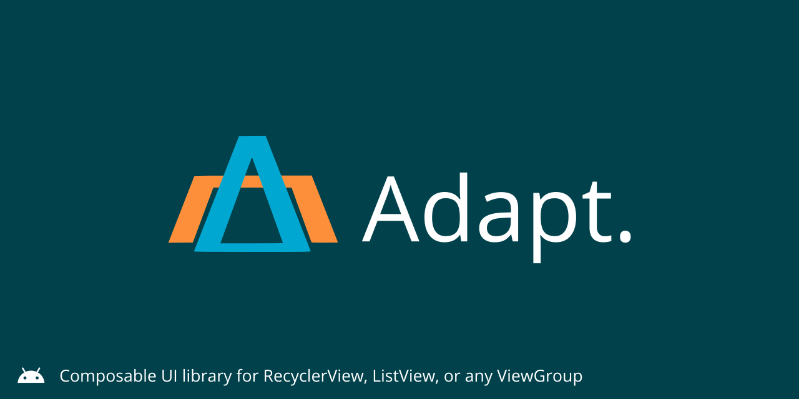
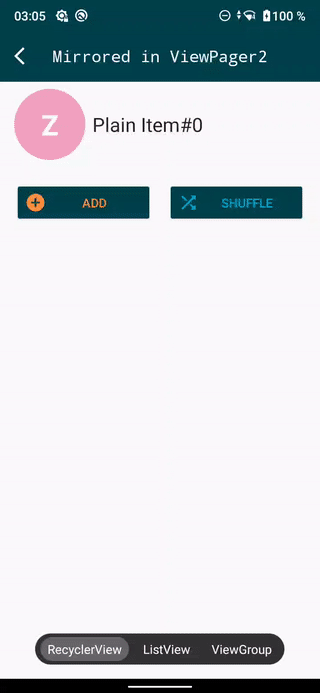
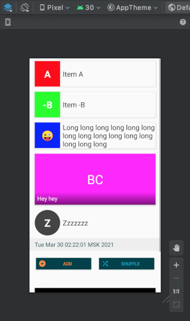

# Adapt

`Adapt` &mdash; `RecyclerView.Adapter` only shorter.

`Adapt` is a UI library to create decoupled widget components. They can be
  used in a `RecyclerView`, `ListView`, inside a `LinearLayout` or used directly as a `View` interchangeably, 
  no code involved. One `Item` to rule them all. XML layout preview enabled.

`Adapt` components, which are called `Item`s, 
can be displayed **without modification** in those parent widgets: 
 
* `RecyclerView`
  * `ViewPager2`<sup>*</sup>
* `AdapterView`
  * `ListView`
  * `Spinner`<sup>**</sup>
  * `GridView`
  * `StackView`
  * `AdapterViewFlipper`<sup>***</sup>
  * `AlertDialog`<sup>****</sup>
* `ViewGroup`
  * `LinearLayout`
  * there are no restrictions on actual `ViewGroup`, it can be any `ViewGroup`


<em><sup>\*</sup> &mdash; `Item` in `ViewPager2` must have `match_parent` as width and height</em><br />
<em><sup>\*\*</sup> &mdash; `Spinner` supports only a single view type</em><br />
<em><sup>\*\*\*</sup> &mdash; wait, wat?</em><br />
<em><sup>\*\*\*\*</sup> &mdash; `AlertDailog` accepts a `ListAdapter`</em><br />






## Install

[](http://search.maven.org/#search|ga|1|g%3A%22io.noties%22%20AND%20a%3A%22adapt%22)

```gradle
implementation "io.noties:adapt:${adaptVersion}"
```

### Pros
* Interchangeable items between `RecyclerView`, `ListView` (all children of `android.widget.AdapterView`) 
  and different `ViewGroup`s (same item is used without modification)
* No prior usage registration - any instance of an `Item` can be displayed right away
* Render individual item as a regular Android widget view (via `AdaptView`)
* Modular design is enforced, leading to re-usable view components
* Ability to preview item in Layout Preview (by using `AdaptViewGroup`), display 
  available design components without launching on a device without leaving IDE

### Cons
* Targeted at relatively small lists, `Adapt` is not a direct replacement 
  for a `RecyclerView.Adapter` containing huge/lazy lists

## Usage

```kotlin
class PageIndicatorItem(
    val title: String,
    var selected: Boolean,
    val onClick: (PageIndicatorItem) -> Unit
) : ItemLayout(hash(title), R.layout.item_page_indicator) {
    
    override fun bind(holder: CachedHolder) {
        // obtain required view (cached internally by the holder)
        val titleView: TextView = holder.requireView(R.id.title)
        // bind data
        titleView.text = title
        holder.itemView().also {
            it.setOnClickListener { onClick(this) }
            it.activate(selected)
        }
    }
}
```

Apart from XML layout this is the complete `Item` that can be used with `Adapt`. Each item
must have an `id` set (the first argument to constructor). Here `Item.hash(vararg any: Any)` is used,
which is a convenience method call to `Objects.hash`. `ItemLayout` uses special `Holder` that
caches views queried, so it is safe to `requireView` with each `bind` call.

```kotlin
val container: ViewGroup = view.findViewById(R.id.container)
val adapt = AdaptViewGroup.init(container)

// click handler
fun onClick(item: PageIndicatorItem) {/*...*/}

// create a list of Items
val items: List<Item<*>> = listOf(
    PageIndicatorItem("Page 1", false, ::onClick),
    PageIndicatorItem("Page 2", false, ::onClick),
    PageIndicatorItem("Page 3", false, ::onClick)
)

adapt.setItems(items)
```

`Adapt` accepts `List<Item<*>>` so your list can contain any other `Item`s - you don't need
to register them beforehand. By changing 2 lines we can display the same list in a `RecyclerView`:

```kotlin
val recyclerView: RecyclerView = obtainRecyclerView()
val adapt = AdaptRecyclerView.init(recyclerView)
```

or a `ListView`:

```kotlin
val listView: ListView = view.findViewById(R.id.list_view)
val adapt = AdaptListView.init(listView)
```

### RecyclerView

```kotlin
val adapt = AdaptRecyclerView.init(recyclerView) {

    // data set change handler that takes care of updating underlying list of items
    //  optional, by default NotifyDataSetChangedHandler
    it.dataSetChangeHandler(DiffUtilDataSetChangedHandler.create())

    // optional, by default true
    it.hasStableIds(false)
}
```

Additionally there is also `create` factory method that creates `AdaptRecyclerView` instance
without actual `RecyclerView` - for example to be used with `ViewPager2`:

```kotlin
// additionally can also specify `dataSetChangedHandler` 
//  and `hasStableIds` if supplied configurator lambda
val adapt = AdaptRecyclerView.create()
val viewPager2: ViewPager2 = view.findViewById(R.id.view_pager2)

viewPager2.adapter = adapt.adapter()
```

There is also `StickyItemDecoration` that allows creating _sticky_ items (aka section items).
Refer to the sample application for sample usage.

### ListView

```kotlin
val adapt = AdaptListView.init(listView) {

    // value that is returned from `Adapter.hasStableIds`
    //  optional, by default true
    it.hasStableIds(false)

    // indicates if all items are enabled, in ListView's language if all items should be 
    //  clickable (delivered by ListView.OnItemClickListener) and have a divider after them
    // by default false, all disabled unless specified further 
    //  by enabling individual items (see below)
    it.areAllItemsEnabled(true);

    // includes specified Item, `isEnabled = false`
    it.include(Item::class.java)

    // includes specified Item and isEnabled
    it.include(Item::class.java, true)
}
```

Registration of `Item`s (via `include` calls) is optional in most of the cases. Still, if you are planning to use
only `android.widget.Adapter` (or any of its siblings like `ListAdapter`) without holding an `AdapterView` instance,
for example in an `AlertDialog` **and** there are multiple item views (multiple types of `Item`s
will be displayed) then all displayed items must be _included_ explicitly.

This registration can also be a good optimization, because internally `AdaptListView` will
rebuild internal `ListView` scrap cache when new item views (types of `Item`s) are encountered.

```kotlin
val adapt = AdaptListView.create(view.context) {
    // all items must be explicitly registered
    // if there is only one item, then it is not required
    it.include(CardBigItem::class.java)
    it.include(CardItem::class.java)
    it.include(ControlItem::class.java)
    it.include(PlainItem::class.java)
}

// from sample application
adapt.setItems(/*...*/)

AlertDialog.Builder(view.context)
    .setAdapter(adapt.adapter()) { _, position ->
        // item at position is clicked
    }
    .show()
```

### ViewGroup

```kotlin
// LinearLayout is the most obvious ViewGroup for this
//  but it can be any other suitable ViewGroup as well
val container: LinearLayout = view.findViewById(R.id.container)
val adapt = AdaptViewGroup.init(container) {

    // optional
    // in this case all changes are going to be animated by default Transition
    it.changeHandler(TransitionChangeHandler.create())

    // optional, used to create Item views
    it.layoutInflater(LayoutInflater.from(context))

    // optional, in case a custom diffing algorithm is required
    it.adaptViewGroupDiff(AdaptViewGroupDiff.create())
}
```

**NB!** A list of `Item`s supplied to `AdaptViewGroup` must have unique ids for the same 
type (multiple items of the same type cannot have duplicate ids). `Item.NO_ID` can be used, but this would
result in `Item`'s view being created each time anew. So, if possible, consider having unique ids even
for supplementary items.

### Item

The core `Item` class (which `ItemLayout` subclasses) is `Item`:

```kotlin
class SectionItem(val text: String) :
    Item<SectionItem.Holder>(hash(SectionItem::class, text)) {

    // this holder does not cache views returned by `requireView` and `findView` 
    class Holder(view: View) : Item.Holder(view) {
        val textView: TextView = requireView(R.id.text)
    }

    override fun createHolder(inflater: LayoutInflater, parent: ViewGroup): Holder {
        return Holder(inflater.inflate(R.layout.item_section, parent, false))
    }

    override fun bind(holder: Holder) {
        holder.textView.text = text
    }
}
```

### View

`AdaptView` can be used to display a single `Item` in your current layout. 

```kotlin
val container: ViewGroup = findViewById(R.id.view_group)
val adaptView: AdaptView = AdaptView.init(container)

adaptView.setItem(SectionItem("Section 1"))
```

### Wrapper

Sometimes an `Item` needs a minor modification depending on layout, like displaying a divider
or having specific background. To achieve that in a _composable_ way (prefer composition over modification)
an `ItemWrapper` can be used:

```kotlin
class PaddingWrapper(val padding: Int, item: Item<*>) : ItemWrapper(item) {
    override fun bind(holder: Holder) {
        super.bind(holder)
        holder.itemView()
            .setPadding(padding, padding, padding, padding)
    }
}
```

Important thing to note here - if `ItemWrapper` creates a modification based on a _variable_
then it should apply its modification in `bind(Holder)` method. For example if your list
contains `PaddingWrapper(12), PaddingWrapper(4)` (actual `padding` variable is different), 
then `bind(Holder)` must be used. If, on the other hand, `PaddingWrapper` would always apply the same
value (some constant value), then `createHolder(LayoutInflater,ViewGroup)` can be used instead.

`ItemWrapper` allows wrapping other `ItemWrapper`, for example:

```kotlin
class MarginWrapper(val margin: Int, item: Item<*>) : ItemWrapper(item) {
    override fun bind(holder: Holder) {
        super.bind(holder)
        val lp = holder.itemView().layoutParams as ViewGroup.MarginLayoutParams
        lp.setMargins(margin, margin, margin, margin)
        holder.itemView().layoutParams = lp
    }
}
```

```kotlin
val mp = MarginWrapper(12, PaddingWrapper(24, TextItem("Margin / Padding")))
val pm = PaddingWrapper(8, MarginWrapper(100, TextItem("Padding / Margin")))

assert(mp.viewType() != pm.viewType())
```

Each `ItemWrapper` changes `viewType` of resulting `Item`. This functionality is
encapsulated by the `Item.Key` class:

```kotlin
val key = Item.Key.builder(TextItem::class.java)
    .wrapped(MarginWrapper::class.java)
    .wrapped(PaddingWrapper::class.java)
    .build()
```

`Item.Key` should be used when an explicit item registration is required, for example
when used with the `AlertDialog` (or item in `ListView` should be _enabled_):

```kotlin
val adapt = AdaptListView.create(context) {

    // simple TextItem
    it.include(TextItem::class.java)

    // TextItem wrapped in `PaddingWrapper`
    val pt = Item.Key.builder(TextItem::class.java)
        .wrapped(PaddingWrapper::class.java)
        .build()
    it.include(pt)

    // TextItem wrapped in `MarginWrapper`
    val mt = Item.Key.builder(TextItem::class.java)
        .wrapped(MarginWrapper::class.java)
        .build()
    it.include(mt)
}

val items = listOf(
    TextItem("Text"),
    PaddingWrapper(12, TextItem("Padding / Text")),
    MarginWrapper(96, TextItem("Margin / Text"))
)

adapt.setItems(items)

AlertDialog.Builder(context)
    .setAdapter(adapt.adapter()) { _, _ ->
        
    }
    .show()
```

Please note that explicit registration is required in only some cases of `ListView/AdapterView`.

```kotlin
// since 4.0.0 all items have special `wrap` method
val item = TextItem("This is text")
  .wrap(BackgroundWrapper.init(0xFFff0000))

// instead of 
val item = BackgroundWrapper(0xFFff0000, TextItem("This is text"))

// which can be turned into an extension function:
fun Item<*>.background(color: Int): Item<*> = wrap(BackgroundWrapper.init(color))

// an used:
val item = TextItem("this is text")
  .background(0xFFff00ff)
```

There is a number of different wrappers distributed along with the library:

* `BackgroundWrapper` - modifies background of item view
* `EnabledWrapper` - sets `isEnabled` for the item view
* `FrameWrapper` - wraps item view in a FrameLayout, accepts width, height and gravity
* `IdWrapper` - changes id of item
* `MarginWrapper` - changes margins of item view
* `OnBindWrapper` - accepts a callback that could be triggered each time `onBind` method of original item is called
* `OnClickWrapper` - adds an `OnClickListener` for item view
* `PaddingWrapper` - changes paddings of item view


## License

```
  Copyright 2021 Dimitry Ivanov (legal@noties.io)

  Licensed under the Apache License, Version 2.0 (the "License");
  you may not use this file except in compliance with the License.
  You may obtain a copy of the License at

      http://www.apache.org/licenses/LICENSE-2.0

  Unless required by applicable law or agreed to in writing, software
  distributed under the License is distributed on an "AS IS" BASIS,
  WITHOUT WARRANTIES OR CONDITIONS OF ANY KIND, either express or implied.
  See the License for the specific language governing permissions and
  limitations under the License.
```