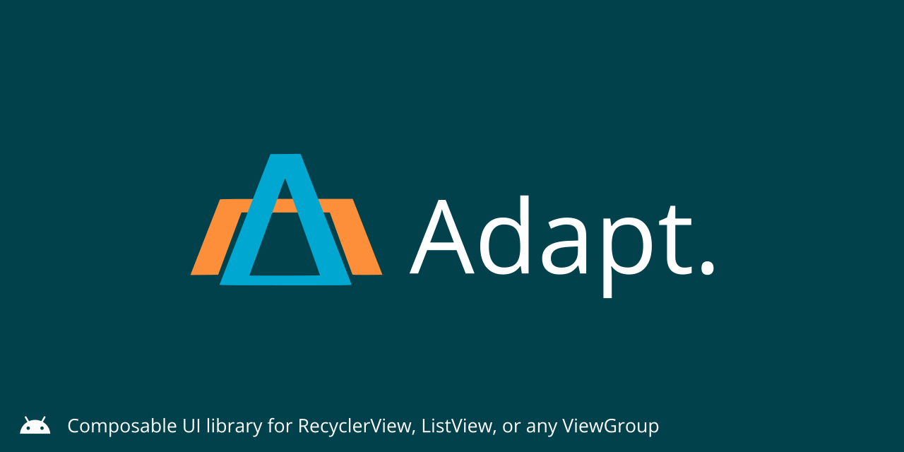
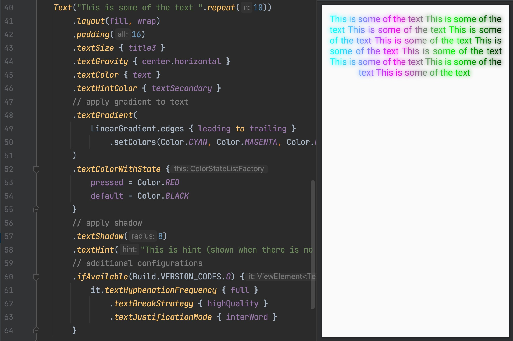
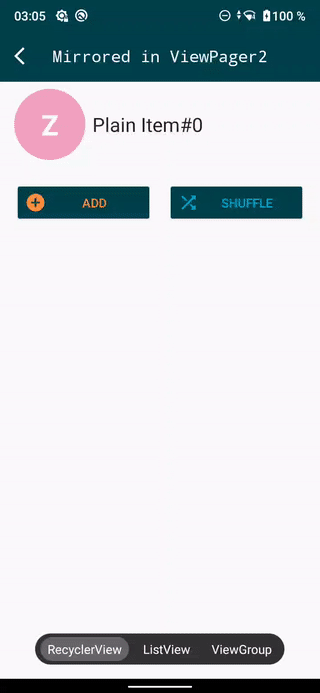

# Adapt &amp; AdaptUI

## Install

[](http://search.maven.org/#search|ga|1|g%3A%22io.noties%22%20AND%20a%3A%22adapt%22)

```gradle
implementation "io.noties:adapt:${adaptVersion}"
implementation "io.noties:adapt-kt:${adaptVersion}"
implementation "io.noties:adapt-ui:${adaptVersion}"
implementation "io.noties:adapt-ui-flex:${adaptVersion}"
```

## [AdaptUI](./adapt-ui/README.md)

Android View DSL in fluent Kotlin. With flexibility in mind and total control over the process. 
Can be used as an enhancement with existing native Android widgets and layouts. 
Creates advanced Android views and layouts in openly-explorable and readable way. 
Influenced by SwiftUI. Adapted to Kotlin.<!-- Android Compose? -->


<a href="./PREVIEW_SHOWCASE.md">🖼️ More previews like this</a><br /><br />
<a href="./adapt-ui/README.md">➡️ Continue reading</a>

---

🚧 \[Documentation is under construction]. Meanwhile, most of the features
  come with a [dedicated sample or samples](./sample/src/main/java/io/noties/adapt/sample/samples). They include
  always relevant code that could be also previewed in the [installed sample application](./releases/latest). 
  Along with Layout Preview in Android Studio to play-around.

---

## [Adapt](./adapt/README.md)

Android **true** adapter. ViewGroup _agnostique_ adapter that interchangeably
renders items across `RecyclerView`, `ListView`, `ViewPager`, `LinearLayout`, `FlexboxLayout`, or any other `ViewGroup`.




[➡️ Continue reading](./adapt/README.md)

## License

```
  Copyright 2021 Dimitry Ivanov (legal@noties.io)

  Licensed under the Apache License, Version 2.0 (the "License");
  you may not use this file except in compliance with the License.
  You may obtain a copy of the License at

      http://www.apache.org/licenses/LICENSE-2.0

  Unless required by applicable law or agreed to in writing, software
  distributed under the License is distributed on an "AS IS" BASIS,
  WITHOUT WARRANTIES OR CONDITIONS OF ANY KIND, either express or implied.
  See the License for the specific language governing permissions and
  limitations under the License.
```